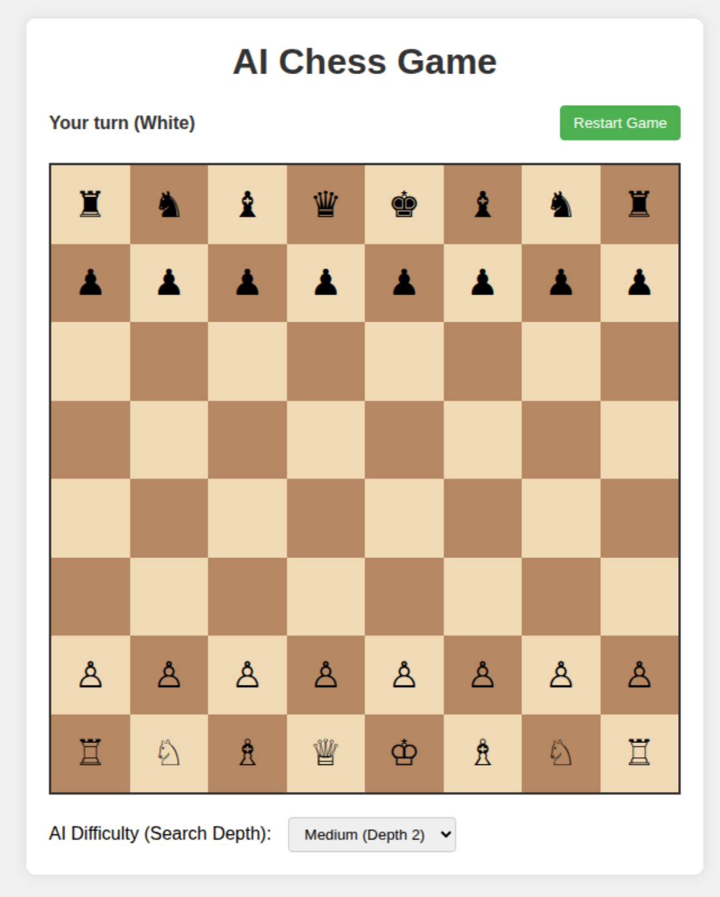
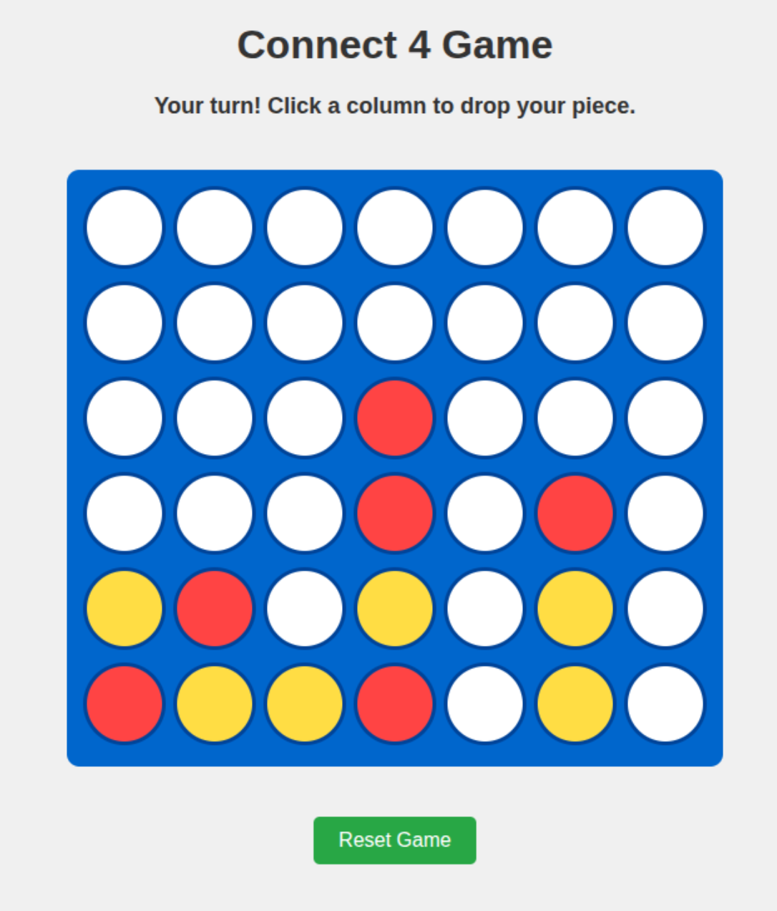
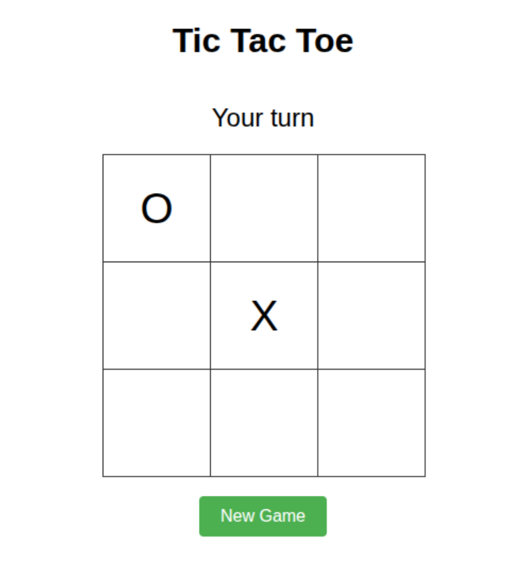

# 🎮 AI Games Collection

This repository contains a collection of classic games implemented with artificial intelligence opponents. Each game demonstrates different AI algorithms for game playing strategies, providing both entertainment and educational value for understanding how computers make decisions in game environments.

## 🎯 Games Included

| Game | Algorithm | Difficulty | Description |
|------|-----------|------------|-------------|
| [Chess](./Chess/) | Minimax with Alpha-Beta Pruning | Medium-Hard | A complete implementation of chess with an AI opponent that can look multiple moves ahead |
| [Connect Four](./Connect-Four/) | Simple Heuristic-based AI | Easy-Medium | Vertical strategy game where players drop colored discs to connect four in a row |
| [Tic-Tac-Toe](./Tic-Tac-Toe/) | Minimax | Medium | Classic 3x3 grid game with an unbeatable AI that demonstrates perfect play |

## 💻 Technologies Used

All games in this collection are built with:
- HTML5 for structure and game boards
- CSS3 for styling and animations
- Vanilla JavaScript (no external libraries required) for game logic and AI implementations
- Responsive design principles for cross-device compatibility

## 🚀 Getting Started

To play any of these games:

1. Navigate to the specific game folder
2. Open the `index.html` file in any modern web browser
3. No installation or setup required!
4. Each game includes its own instructions accessible from within the interface

## 📋 Common Features

- Human vs AI gameplay with intuitive interfaces
- Clean, responsive UI that works across desktop and mobile devices
- Visual feedback for game state, moves, and outcomes
- Restart/reset functionality to start new games
- Different AI approaches tailored to the complexity of each game
- No internet connection required after initial page load
- Lightweight implementation focused on performance

## 📷 Game Previews

### Chess

### Connect Four

### Tic-Tac-Toe

## 📚 Learning Objectives

These games demonstrate various concepts in AI and game theory:
- Game tree search techniques and their practical limitations
- Minimax algorithm implementation with varying levels of complexity
- Alpha-beta pruning for optimization of tree-based search
- Heuristic evaluation functions for estimating game positions
- Simple vs complex state spaces and their impact on AI approach
- Trade-offs between perfect play and computational efficiency
- How different games require different AI strategies

Each game includes its own detailed README file explaining the specific AI implementation details, game rules, and strategic considerations. These implementations serve as practical examples of AI concepts in action, making abstract algorithms tangible and interactive.
